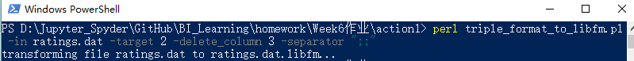
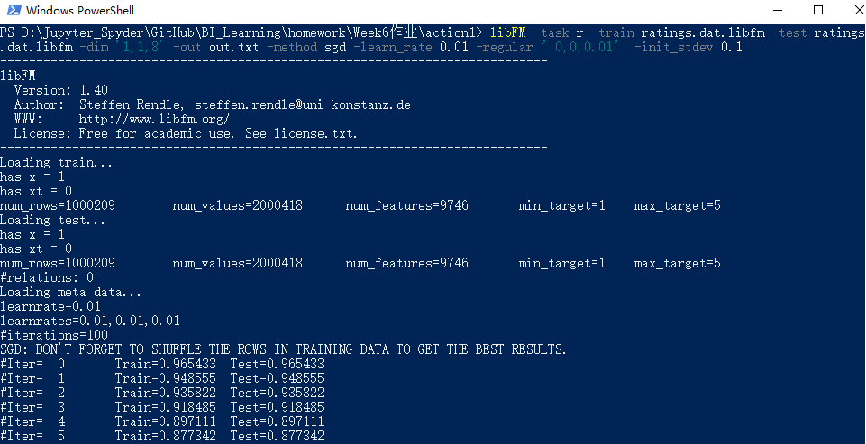
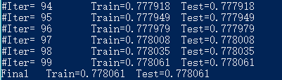
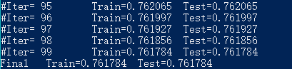

1. 一开始想尝试直接用python来进行数据转换，但后来发现"triple_format_to_libfm"转换的one-hot编码格式与pandas的直接get_dummies还不太一样，后来嫌麻烦还是没继续这么弄了..

   

2. 利用 triple_format_to_libfm 进行数据格式转换：

   

    

3.  进行模型训练与测试

   * 单特征转换的隐特征向量**维度为8**时

     ```
     libFM -task r -train ratings.dat.libfm -test ratings.dat.libfm -dim '1,1,8' -out out.txt -method sgd -learn_rate 0.01 -regular ’0,0,0.01’ -init_stdev 0.1
     ```

     

     

   * 单特征转换的隐特征向量**维度为10**时

     ```
     libFM -task r -train ratings.dat.libfm -test ratings.dat.libfm -dim '1,1,10' -out out.txt -method sgd -learn_rate 0.01 -regular ’0,0,0.01’ -init_stdev 0.1
     ```

     

     * 可见，logloss此时更小，比维度为8的情况要好
  * 设置迭代次数为1000时，Train=0.752628  Test=0.752628，提升幅度不大，有点过拟合
   
* 单特征转换的隐特征向量**维度为20**时，Train=0.693224  Test=0.693224
   

虽然提高隐特征向量维度使得logloss降低，但由于测试集采用了与训练集一样的数据，无法判断模型泛化能力。