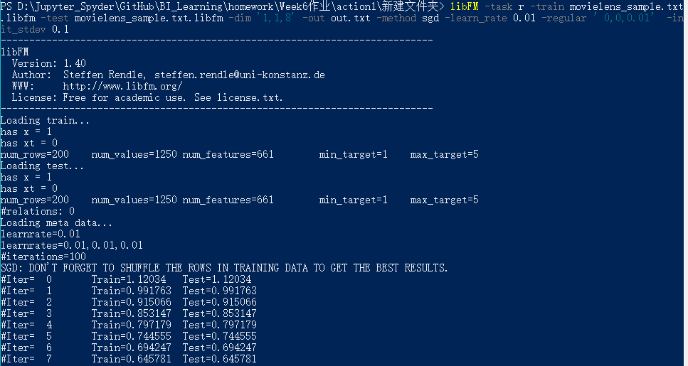
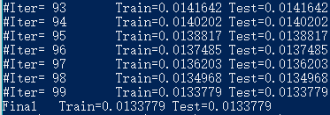

### 使用movielens_sample.txt数据集进行尝试

1. 利用 triple_format_to_libfm 进行数据格式转换：

   ```
   perl .\triple_format_to_libfm.pl -in .\mo
   vielens_sample.txt -target 2 -delete_column 3,4,5 -separator ","
   ```

    

2. 进行模型训练与测试

   * 单特征转换的隐特征向量**维度为8**时

     ```
     libFM -task r -train movielens_sample.txt.libfm -test movielens_sample.txt.libfm -dim '1,1,8' -out out.txt -method sgd -learn_rate 0.01 -regular ’0,0,0.01’ -init_stdev 0.1
     ```

     

     

     

     数据集较小，有点过拟合。
